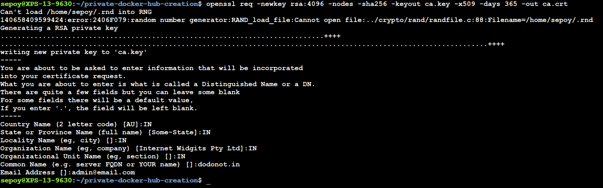

# Create the private docker hub


Require two nodes

    repo-server 10.0.0.2
    repo-client 10.0.0.3

Dependencies packages

    docker packages required

Custom domain name map with repo-server

    Here I assign with dodonot.in domain in to repo-server.

```sh

    echo "10.0.0.2 dodonot.in" | sudo tee -a /etc/hosts

```

Create the certificate for the usage of secure auth 

    openssl req -newkey rsa:4096 -nodes -sha256 -keyout ca.key -x509 -days 365 -out ca.crt




copy the certs file into target location

```sh

    cp ca.crt /etc/certs
    cp ca.key /etc/certs

```

create the repo server using the registry:2 docker image

```sh
    
    docker run -d \
        --restart=always \
        --name registry  \
        -v /etc/certs:/certs  \
        -e REGISTRY_HTTP_ADDR=0.0.0.0:443 \  
        -e REGISTRY_HTTP_TLS_CERTIFICATE=/certs/ca.crt \
        -e REGISTRY_HTTP_TLS_KEY=/certs/ca.key 
        -p 443:443 \
        registry:2

```

check the container status

```sh

    docker ps -a
    docker logs registry

```

verify the docker image pull and push status in repo server

```sh

    docker pull nginx ( this is pulll from docker hub )
    docker tag dodonot.in/nginx:1.0
    docker push dodonot.in/nginx:1.0

```

# How to access the repo server from client

make an dns entry with in client level

```sh

    echo "10.0.0.2 dodonot.in" | sudo tee -a /etc/hosts
    mkdir -p /etc/docker/certs.d/dodonot.in
    scp root@dodonot.in:/etc/certs/ca.crt /etc/docker/certs.d/dodonot.in/
    systemctl restart docker

```
verify the docker repo access from client server

```sh

    docker pull dodonot.in/nginx:1.0

```
